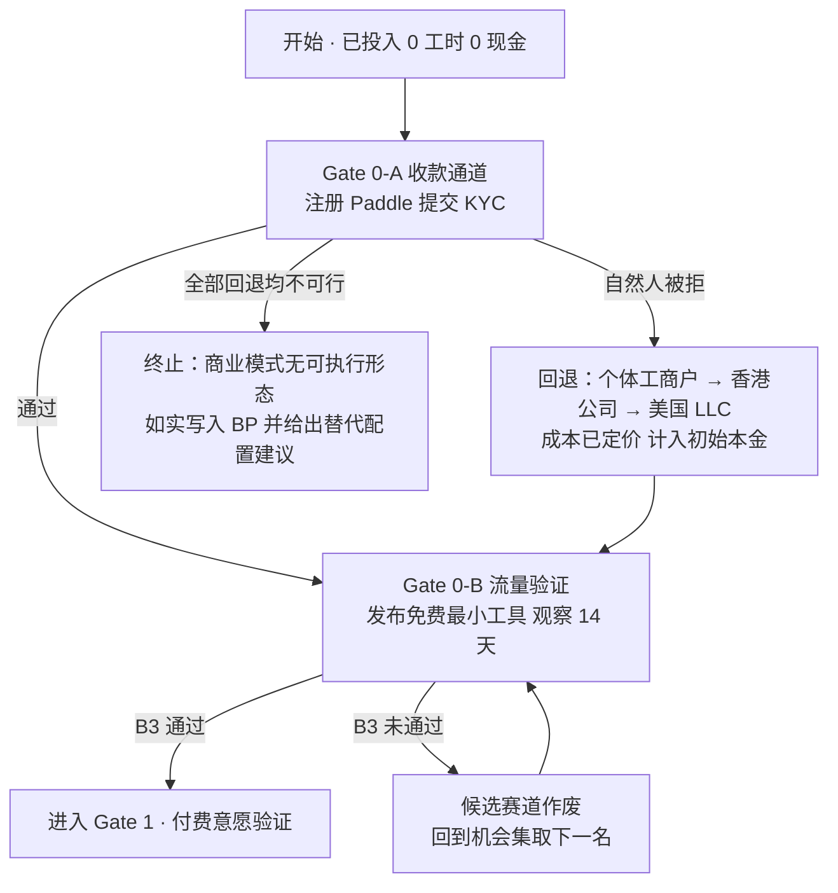

# Gate 0 · 阻断性前置验证

> **定位：** Gate 0 是先于一切开发的二元关卡。它检验的不是"这个生意好不好"，而是"这个生意在物理上能不能成立"。
> **纪律：Gate 0 未通过前，投入的开发工时上限为 0 小时，现金上限为 0 美元。**
> 理由：若收不到钱或拿不到流量，后续所有阶段目标、单位经济学、Kelly 比例全部无意义 —— 不是数值变差，是整个模型的定义域为空。

**基准日：2026-07-27**

---

## 0. 为什么把这一关排在最前

传统 BP 的写法是先讲市场、再讲产品、最后附一句"公司注册与收款另行安排"。对本项目这是**顺序错误**。

本项目的硬约束是：**中国大陆自然人 + 零员工 + 全球美元自助订阅 + 无人工介入**。这四条叠加后，收款通道从"实施细节"升格为**存在性前提**：

- 已确认硬事实 [A]：**Stripe 不支持中国大陆主体开户**（https://stripe.com/global 支持地区列表不含中国大陆，2026-07-27 核）
- 而"信用卡自助订阅"没有 Stripe 或等价物就无法实现
- 因此若所有 MoR 通道都拒绝中国大陆主体，本项目的商业模式**不存在可执行形态**，必须先重做实体结构

同理，获客侧：`BENCHMARKS.md` 的漏斗串联表明维持 $1,000 MRR 需要每月 **2,729 个精准开发者访客**（推导见 §3.1）。若找不到一个可自动化、可持续的流量来源，产品做得再好也只是一个没人知道的网页。

**这两条都可以在两周内、零成本、零代码地验证完。** 先验证，再开发。

---

## 1. Gate 0-A · 收款通道（已基本查清，剩余为实操验证）

### 1.1 核查结果汇总

| 通道 | 中国大陆主体可否收款 | 证据等级 | 一手来源 |
|---|---|---|---|
| **Stripe（直连）** | **否** | A | https://stripe.com/global 支持地区列表不含中国大陆 |
| **Polar** | **否** | A | 付款国别清单含香港/澳门/台湾，**不含中国大陆** |
| **Lemon Squeezy** | **否**（银行打款） | A | 银行付款支持国清单含香港/澳门/台湾，**不含中国大陆** |
| **Paddle** | **是（高置信）** | A | 卖方不支持国清单不含中国；**CNY 为官方支持的打款币种** |
| **GitHub Marketplace** | 存疑 | D | 要求组织主体 + 域名验证 + 月满 $500 才付款；未见国别清单 |

### 1.2 三条否定结论的依据

**Polar —— 否。** Polar 用 Stripe Connect Express 发放款项，官方《Supported countries》页的付款国别清单逐条列出 100 余国，**其中有 Hong Kong、Macao、Taiwan、Japan、Singapore、South Korea、India、Vietnam，唯独没有 China / Mainland China**。
- 来源：https://polar.sh/docs/merchant-of-record/supported-countries （2026-07-27 抓取全文核对）
- 追加约束（同样致命）：Polar 官方 FAQ 明说 **"Stripe Connect requires the bank account you connect to be in the same country as the business, in the local currency"**，且 **"Most multi-currency or 'borderless' accounts (Wise, Payoneer, Revolut, etc.) do not satisfy Stripe's verification for Connect payouts"**。
  → **含义：即便注册美国 LLC，也必须有真实的美国本地银行账户；Wise / Payoneer 这类虚拟账户大概率过不了验证。** 这一条推翻了网上流传的"注册美国 LLC + Wise 收款"的通行做法。来源：https://polar.sh/docs/features/finance/accounts

**Lemon Squeezy —— 否（银行打款）。** 官方《Supported Countries》页的银行付款支持国清单同样含 Hong Kong、Macao、Taiwan 而**不含中国大陆**。
- 来源：https://docs.lemonsqueezy.com/help/getting-started/supported-countries
- 页面开头写 "merchants and affiliates who can receive **bank or PayPal payouts**"，理论上 PayPal 是一条旁路，但 **PayPal 中国大陆个人账户的跨境收款与提现另有限制，本轮未核实，不得作为方案依据**。
- 附带结构性不确定性：Lemon Squeezy 现由 Stripe 拥有（页脚 "Sold through Link, LLC f/k/a Lemon Squeezy LLC"），其长期路线与 Stripe 自家 MoR 产品的关系存疑。

**Stripe 直连 —— 否。** 且**明确不采纳**检索中出现的"用住宅代理 + 境外实体伪装成在当地运营"一类做法。这类做法可能违反 Stripe 服务协议，后果是账户冻结与资金扣留。**合规的做法是真实地在受支持司法辖区设立实体并在当地实际运营，而不是伪装成在那里。**（对应工作原则第五条、第六条）

### 1.3 Paddle —— 唯一通过的通道，依据有三层

**第一层：卖方国别（决定性）** [A]
Paddle 官方帮助中心《Which countries are supported by Paddle?》原文：

> "Paddle works with software businesses **anywhere in the world** with the exception of the unsupported countries listed below. In accordance with international sanctions regulations... Paddle is unable to support **suppliers operating from** the below countries."

不支持国清单（26 项）：Afghanistan、Antarctica、Belarus、Burma、Central African Republic、Cuba、Crimea、DR Congo、Donetsk、Haiti、Iran、Iraq、Kherson、Libya、Luhansk、Mali、Netherlands Antilles、Nicaragua、North Korea、Russia、Somalia、South Sudan、Sudan、Syria、Venezuela、Yemen、Zaporizhzhia、Zimbabwe。
**中国不在其中。** 且措辞是 "suppliers operating from"，明确指向卖方而非买方。
- 来源：https://www.paddle.com/help/start/intro-to-paddle/which-countries-are-supported-by-paddle

> **一处必须避免的误读（记录在案）：** developer.paddle.com 的《Supported countries and locales》表格里也有 `CN | China | CNY`，但那张表的列是"币种 / 含税偏好 / 是否需要邮编"，是**买方结算表**，不是卖方资格表。第三方聚合站 supportedcountries.com 把两者混为一谈。**本文件的结论不依赖那张表。**

**第二层：打款币种（强佐证）** [A]
Paddle 官方《Can I be paid in my local currency?》列出 13 种支持的打款币种，**其中明确包含 Chinese Yuan (CNY)**。
- 来源：https://www.paddle.com/help/manage/get-paid/can-i-be-paid-in-my-local-currency
- 开发者文档《Supported currencies》的 Payout currencies 表同样列出 `CNY | Chinese Yuan`。https://developer.paddle.com/concepts/sell/supported-currencies
- **一家 MoR 不会为一个不允许开户的国家维护本币打款通道。这是极强的间接证据。**

**第三层：打款机制** [A]
- 方式：电汇（Wire/ACH/SEPA）或 **Payoneer**
- 频率：每月一次
- 最低门槛：**$100**（可上调至 $100,000）；未达门槛顺延至下月
- 费用：打款币种与开户行所在国本币一致时通常免费；跨币种走 SWIFT 收 $15；跨币种转换另收最高 **1.5%** 汇兑价差
- 来源：https://www.paddle.com/help/manage/get-paid/when-and-how-do-i-get-paid 、https://www.paddle.com/help/manage/get-paid/is-there-a-fee-taken-for-payouts

> **建模含义（写入 `assumptions.py`）：** 若选 CNY 打款到境内银行，可避开 $15 SWIFT 费但要承担最高 1.5% 汇兑价差；若选 USD 打款，需承担 $15/笔 SWIFT 费。**月付一次、$100 门槛意味着现金流回笼有最长约 60 天的延迟，模型中需体现。**

**第四层：业务类型合规性** [A]
Paddle 可接受使用政策（AUP）：明确服务于 B2B SaaS、消费软件、游戏；**禁止**人工服务、实体商品、金融/交易服务、支付服务、加密货币交易所、无真实软件的众筹/捐赠/社群准入。
- 本项目为纯软件订阅，**落在允许范围内**。
- 来源：https://www.paddle.com/help/start/intro-to-paddle/what-am-i-not-allowed-to-sell-on-paddle

### 1.4 残余风险（Gate 0-A 剩余的实操验证）

Paddle 官方保留了这句话：**"Our team may from time to time request further information before processing an order or releasing a payment from any location or jurisdiction for risk and compliance purposes."**

因此**"清单上没有中国"不等于"我这个具体主体一定能过 KYC"**。剩余三个必须实测的问题：

| # | 待验证问题 | 验证方式 | 通过标准 |
|---|---|---|---|
| A1 | 中国大陆**自然人**（非公司）能否完成 Paddle 卖家 KYC | 注册 Paddle 账号并提交实名验证材料 | 收到 approved 通知 |
| A2 | 中国大陆银行账户能否成功接收 CNY 打款 | KYC 通过后在 Transfer Preferences 填入境内银行卡并保存 | 系统接受并显示 verified |
| A3 | Paddle 是否要求可访问的正式网站（含条款/隐私/定价页） | 审核问询中确认 | 明确列出所需材料清单 |

**若 A1 失败，回退路径（按成本升序）：**

1. **中国大陆个体工商户 / 有限公司**（成本 ≈ ¥0–2,000，1–2 周）
   —— 若 Paddle 拒绝自然人但接受企业主体，这是最低成本回退。
2. **香港有限公司**（成本约 HK$8,000–15,000/年含秘书与年审，2–4 周）
   —— 香港在 **Polar / Lemon Squeezy / Paddle 三家的清单里全部在列**，是唯一能同时打开三条通道的回退。但需开立香港银行账户（近年对内地人士开户审核趋严，且有最低存款要求），且触发香港利得税申报义务。
3. **美国 LLC + 美国本地银行账户**（Stripe Atlas 约 $500 设立费 + 州年费）
   —— 打开全部通道，但成本最高：需每年申报 **IRS Form 5472**（漏报罚款起点 $25,000），且据 Polar 官方说明，**Wise / Payoneer 虚拟账户大概率不被 Stripe Connect 接受，必须真实美国本地银行账户**。

**回退触发即意味着现金支出与工时支出，因此这三条必须先算进 Kelly 的初始本金里，而不是事后追加。** 本 BP 的现金上限 $4,000 中，已为此预留（见 `model/assumptions.py` 中 `ENTITY_SETUP_RESERVE_USD`）。

### 1.5 税务与外汇：明确划出能力边界

**以下三个问题本 BP 不给答案，必须由持牌专业人士处理**（对应工作原则第十条 边界与担当）：

1. 中国税务居民取得的境外 SaaS 订阅收入在中国的纳税义务认定（经营所得 / 综合所得 / 受控外国企业规则）
2. 若采用美国 LLC，Form 5472 / Form 1120 申报义务与 ECI（有效关联所得）判定
3. MoR 平台打款到境内的性质认定（服务贸易收入 vs 其他），及对应增值税与所得税处理

**可以引用的官方原文（仅作背景，非建议）：**
- 《经常项目外汇业务指引（2020 年版）》（**汇发〔2020〕14 号**）第五十四条：个人结汇与境内个人购汇实行年度便利化额度管理，**便利化额度为每人每年等值 5 万美元**。第五十六条：超过便利化额度的经常项目结汇，凭有效身份证件 + **有交易额的结汇资金来源材料**在银行办理。第六十二条：**个人不得以分拆等方式规避便利化额度管理**，违规者列入关注名单（当年及之后连续 2 年）。全文：https://www.gov.cn/gongbao/content/2020/content_5560296.htm
- 国家外汇管理局厦门市分局明确澄清：**"等值 5 万美元是年度便利化额度，不是个人每年结汇、购汇的限额"**，真实合法的经常项目结汇无金额限制。
- 《关于支持贸易新业态发展的通知》（**汇发〔2020〕11 号**）：从事跨境电子商务的境内个人，提供有交易额的证明材料或交易电子信息的，**不占用年度便利化额度**。
  ⚠️ **存疑点：SaaS 订阅收入是否被认定为"跨境电子商务"项下的服务贸易，取决于经办银行的具体认定，各行口径不一。开户前必须与具体银行确认。**

**明确不采纳的做法：** 分拆结汇、借用他人额度、虚构交易背景。这些既违反汇发〔2020〕14 号第六十二条，也违背本项目的第五条（合法合规）与第四条（公允公正）。**宁可多付费率、多缴税，不碰这条线。**

### 1.6 Gate 0-A 判定

| 状态 | 判定 |
|---|---|
| **通道存在性** | ✅ **通过** —— Paddle 在国别与币种两层均支持中国大陆，有一手官方来源 |
| **主体适格性** | ⏳ **待实测** —— A1/A2/A3 三项，预计 1–2 周、零成本 |
| **回退路径** | ✅ **存在且已定价** —— 三级回退，最高成本约 $500 + 年费 |

**结论：Gate 0-A 从"可能坍塌整个模型的二元风险"降级为"高概率通过、有明确回退的实操事项"。** 这是本轮验证最有价值的产出：它把一个未知的存在性风险，变成了一个已知的成本项。

---

## 2. Gate 0-B · 获客流量来源（未通过，且这是本项目真正的主要矛盾）

### 2.1 为什么这一关比产品更重要

把 `BENCHMARKS.md` 第 1、2 节的保守取值串联（计算见 `model/funnel.py`）：

```
每 1,000 个精准访客
  × 4.5%  访客→注册           = 45 个注册
  × 3.0%  注册→付费（6 个月内） = 1.35 个付费客户
  × $19   客单价               = $25.65 新增 MRR
```

在 7% 月流失下，稳态客户数 = 月新增 ÷ 月流失率。要维持 **$1,000 MRR**（约 52.6 个客户）：

```
52.6 个客户 × 7% = 3.68 个客户/月的流失需要补上
3.68 ÷ 1.35 付费客户/千访客 × 1,000 = 2,729 个访客/月
```

**即：$1,000 MRR 不是一次性目标，而是一台需要每月喂进 2,729 个精准开发者访客才能维持不掉的机器。**

而流量侧的现实（全部 A 级）：

- Ahrefs 追踪 **100 万个随机 URL** 12 个月：新页面进入 Google 前十的概率 **1.74%**；高搜索量词 **0.3%**
- Hacker News 头版：10,000–30,000 UV / 24 小时，**48 小时内衰减到零**
- Product Hunt：7 日注册 100–150，**一次性、非复利**
- IndieLaunches 对 326 个 HN 项目的渠道统计：HN 本身绝大多数是**次要**渠道（被提及 201 次），真正的主力是**口碑**（87 次提及、40 次为主渠道）与 **SEO**（44 次提及、27 次为主渠道）

**一次成功的 HN 头版（保守取 15,000 UV）约产出 20 个付费客户，在 7% 月流失下 14 个月后流失殆尽。** 脉冲不是渠道。

### 2.2 Gate 0-B 的验证设计：先证明能拿到流量，再考虑做产品

**核心思想：流量验证不需要产品。** 一篇文章、一个免费脚本、一个 GitHub 仓库就足以测出"这个话题在这个人群里有没有自然分发力"。**这一步零代码、零成本，且失败了也不亏。**

| 测试 | 具体动作 | 通过标准（客观可检验） | 工时 |
|---|---|---|---|
| **B1 · 搜索需求存在性** | 用 Google Search Console 无法测未上线站点，改用：Ahrefs / Semrush 免费额度查目标关键词族的月搜索量与 KD；同时在 GitHub 搜索相关仓库的 star 增速 | 目标关键词族合计月搜索量 ≥ 1,000 且 KD ≤ 20 的词不少于 5 个 | 3 h |
| **B2 · 社群话题热度** | 在 HN Algolia API 与 Reddit 检索目标问题的近 12 个月讨论，统计帖子数、中位分数、评论数 | 近 12 个月 ≥ 10 个相关讨论串，且至少 3 个得分 > 50 | 3 h |
| **B3 · 免费工具的自然分发力（最硬的一关）** | 发布一个**纯免费、零后端**的最小工具（静态页 / npx 脚本 / GitHub Action），投放到 HN Show HN + 2 个垂直社群，不做任何付费推广 | **上线后 14 天内获得 ≥ 300 个真实独立访客，且 ≥ 30 次实际使用（安装/运行/提交）** | 12 h |
| **B4 · 复利渠道存在性** | 检验是否存在一个"内容/工具越积累、流量越增长"的机制（如 GitHub Action 被 fork、工具被写进他人 README、扫描结果页可被索引） | 能写出至少一条具体的复利机制，并在 B3 中观察到 ≥ 1 次自发的第三方引用 | 4 h |

**总工时约 22 小时 ≈ 1.1 周的可投入时间。**

### 2.3 Gate 0-B 的判定规则（不留模糊空间）

- **四项全过** → 进入 Gate 1（付费意愿验证）
- **B3 未过（< 300 UV 或 < 30 次使用）** → **本候选赛道作废，回到机会集取下一名**。理由：连免费都没人要，收费不可能有人要。
- **B3 过但 B4 未过** → 赛道保留，但**必须在 BP 中把获客假设改为"纯脉冲模型"**，即不假设任何稳态自然流量，稳态 MRR 天花板按脉冲频率重算（这会大幅压低估值，很可能使期望值转负）
- **B1/B2 未过但 B3 过** → 说明这是一个"有痛点但没人搜索"的市场，走社群/口碑而非 SEO，获客计划需重写

### 2.4 Gate 0-B 当前判定

| 状态 | 判定 |
|---|---|
| **流量来源可行性** | ❌ **未通过（未验证）** |

**必须诚实记录：`BENCHMARKS.md` 第 9.1 节把这一条列为"整个模型里最大的空洞"，本 BP 至今没有解决它。** 第 5 章（获客方案）给出的是一个待检验的假设集，不是已验证的结论。**任何声称"我们将通过内容营销获得稳定流量"的表述，在 B3 通过之前都属于一厢情愿。**

---

## 3. Gate 0 总判定与执行顺序



### 3.1 时间与资源预算

| 项 | Gate 0-A | Gate 0-B | 合计 |
|---|---|---|---|
| 日历时间 | 1–2 周（多为等待审核） | 2 周 | **约 3 周（可部分并行）** |
| 实际工时 | 4 h | 22 h | **26 h** |
| 现金 | $0（回退时 $0–500） | $0（域名 $12 可选） | **$0–512** |

**两关可并行：** Gate 0-A 的主要耗时是等待 Paddle 审核，这段时间正好用来跑 Gate 0-B。

### 3.2 写入止损线的硬规则

1. **Gate 0-B 的 B3 未通过前，累计开发工时不得超过 26 小时**（即 Gate 0 自身的工时预算）。超出即为违规，触发强制复盘。
2. **Gate 0 全过之前，累计现金支出不得超过 $512。**
3. Gate 0-B 的 B3 允许**最多重试 2 次**（换 3 个不同候选赛道各做一次）。三次全败，则结论为"在当前能力与时间约束下，找不到可自动化的获客路径"，**BP 的正确结论是不做**，并转向替代的资金与时间配置（见第 9 章）。

---

## 4. 本章的自我批评

**这一章原本不存在。** 本 BP 的初稿把收款与获客当作"实施细节"放在附录。在完成基准调研后我意识到这是**顺序上的根本错误**：对一个中国大陆单人开发者做全球美元自助订阅，收款是存在性前提而非细节；而漏斗数学表明获客是唯一的稳态约束。

**同时必须承认一个不对称：** Gate 0-A 我用一手来源查清了（并且结果比预期好得多 —— 从"可能坍塌"变成"高概率通过"），但 **Gate 0-B 我没有解决，只是把它形式化成了一个可执行的检验。** 这两者的成熟度不同，不应在 BP 中被同等呈现。

**如果只能记住这一章的一句话：** 收款问题已经从未知变成已知成本；获客问题仍然是未知，而它才是这个项目真正的生死线。
